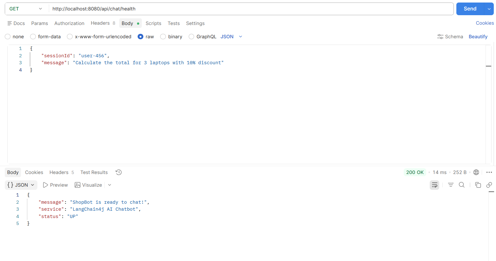
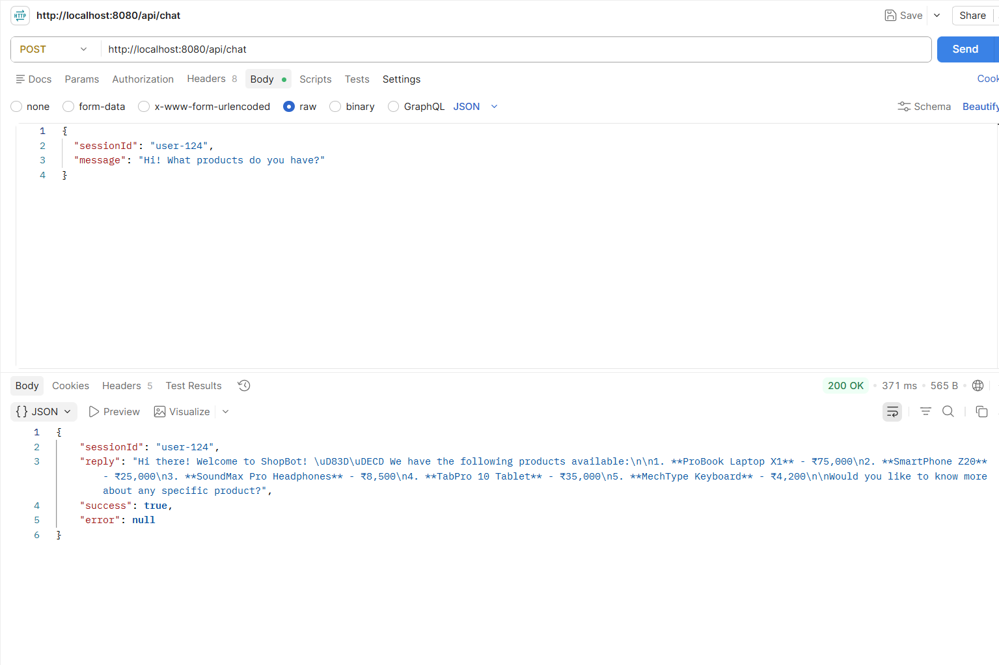
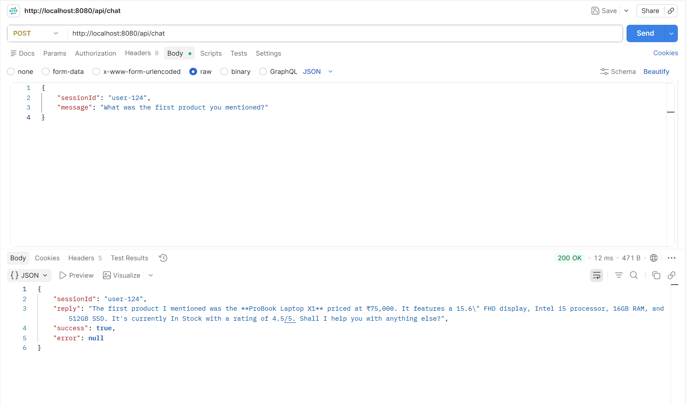
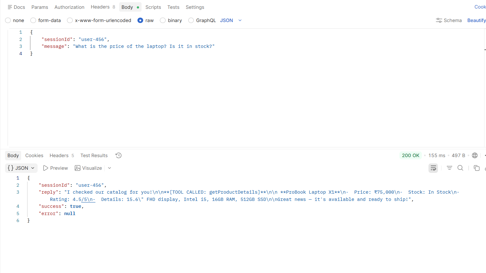
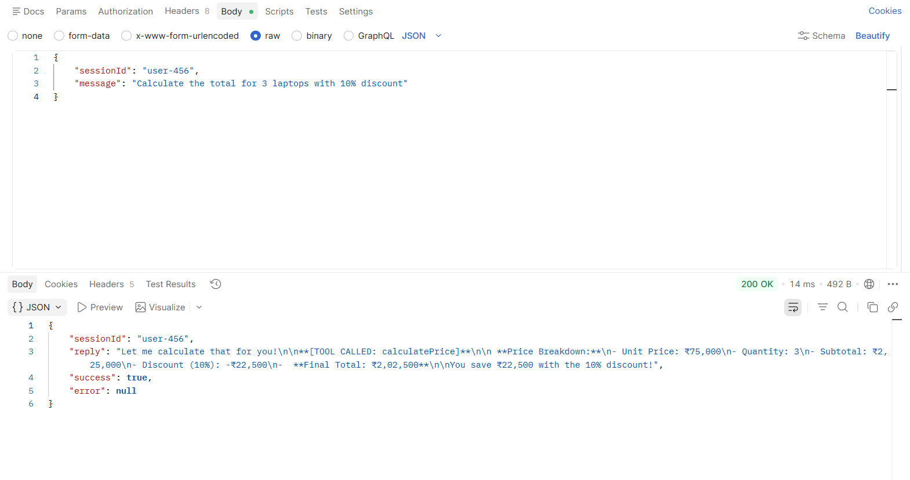
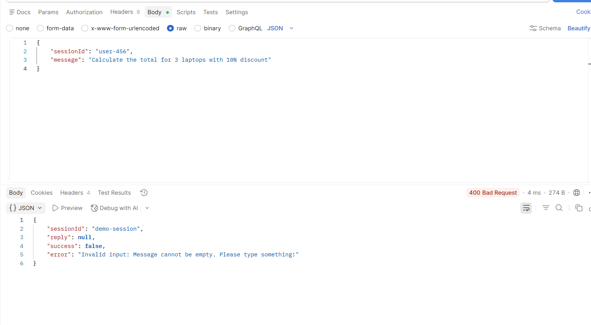

---

## Project Overview

**ShopBot** is an AI-powered chatbot built with **LangChain4j** and **Spring Boot**. It acts as a shopping assistant that can answer questions, look up product details, calculate prices, and tell the current date/time — all through a conversational interface.

The chatbot maintains **multi-turn conversation memory** per session, uses **custom function-calling tools**, and handles errors gracefully with fallback responses.

---

## Tech Stack

| Layer | Technology |
|---|---|
| Framework | Spring Boot 3.2.5 |
| AI Library | LangChain4j 0.36.2 |
| AI Model Provider | OpenAI (GPT-3.5-Turbo) |
| Language | Java 17 |
| Build Tool | Maven |

---

## Project Architecture

```
User (HTTP Request)
       │
       ▼
ChatController  ──── validates input, routes requests
       │
       ▼
ChatService  ──── input validation, error handling, fallback logic
       │
       ▼
AssistantService (@AiService)  ──── LangChain4j AI interface
       │
       ├── OpenAiChatModel  ──── calls OpenAI API (GPT-3.5-Turbo)
       ├── ChatMemory       ──── stores last 10 messages per session
       └── ChatTools        ──── @Tool methods (product lookup, calculator, date)
```

**High-level flow:**
1. User sends a `POST /api/chat` with a `sessionId` and `message`
2. `ChatController` passes it to `ChatService`
3. `ChatService` validates the input and calls `AssistantService`
4. `AssistantService` sends the message + memory + tools to OpenAI
5. OpenAI decides whether to call a tool or reply directly
6. The final response is returned as JSON

---

## Feature Descriptions

### 1. AI Service Layer

The `AssistantService` interface is annotated with `@AiService` — LangChain4j automatically implements it at runtime. It uses:

- **`@SystemMessage`** — sets the chatbot's personality and behavior rules at the start of every conversation
- **`@MemoryId`** — LangChain4j uses this to store and retrieve conversation history per user session, enabling multi-turn conversations
- **`@UserMessage`** — injects the user's input into the AI prompt at runtime

```java
@AiService
public interface AssistantService {
    @SystemMessage("You are ShopBot, a friendly shopping assistant...")
    String chat(@MemoryId String sessionId, @UserMessage String userMessage);
}
```

---

### 2. Prompt Strategy

The system prompt is designed to:
- Define the chatbot's **name** and **role** (ShopBot, shopping assistant)
- List its **capabilities** clearly (product lookup, calculations, date/time)
- Set **behavioral constraints** (concise responses, honest when unsure, under 150 words)
- Instruct it to **use tools automatically** when relevant

This improves output quality by giving the model clear boundaries and purpose.

---

### 3. Tool / Function Calling

Three tools are defined in `ChatTools.java` using `@Tool`:

| Tool | Trigger Example | What it Does |
|---|---|---|
| `getProductDetails(productName)` | "Tell me about laptops" | Returns name, price, stock, rating |
| `calculatePrice(price, qty, discount)` | "What's the total for 3 phones at 10% off?" | Returns full price breakdown |
| `getCurrentDateTime()` | "What time is it?" | Returns current date and time |

The AI **automatically decides** when to call these tools based on user intent — no explicit trigger needed from the user.

---

### 4. Model Parameter Configuration

Configured in `application.properties`:

| Parameter | Value | Effect |
|---|---|---|
| `temperature` | `0.7` | Balanced — creative but coherent responses |
| `max-tokens` | `500` | Limits response length to ~375 words |
| `model-name` | `gpt-3.5-turbo` | Fast, cost-effective model |

**Effect of changing temperature:**

```properties
# Very factual / robotic (good for product catalogs)
langchain4j.open-ai.chat-model.temperature=0.1

# Balanced (default)
langchain4j.open-ai.chat-model.temperature=0.7

# Very creative / unpredictable (good for storytelling)
langchain4j.open-ai.chat-model.temperature=0.9
```

---

## API Endpoints

```
POST   /api/chat               → Send a message to the chatbot
GET    /api/chat/health        → Health check
POST   /api/chat/simulate-error      → Simulate AI failure (demo)
POST   /api/chat/empty-input-error   → Simulate invalid input (demo)
```

### Chat Request

```json
POST /api/chat
{
  "sessionId": "user-123",
  "message": "Tell me about the laptop"
}
```

### Chat Response (Success)

```json
{
  "sessionId": "user-123",
  "reply": "The ProBook Laptop X1 is priced at ₹75,000 and is currently In Stock...",
  "success": true,
  "error": null
}
```

### Chat Response (Error)

```json
{
  "sessionId": "user-123",
  "reply": null,
  "success": false,
  "error": "Invalid input: Message cannot be empty. Please type something!"
}
```

---

## Error Handling

| Scenario | HTTP Status | Handling |
|---|---|---|
| Empty/null message | 400 Bad Request | `InvalidInputException` caught, error message returned |
| Message > 1000 chars | 400 Bad Request | Same as above |
| AI model timeout/failure | 503 Service Unavailable | Try-catch in `ChatService`, fallback message returned |
| Unexpected server error | 500 Internal Server Error | Global catch in `ChatController` |

---

## Setup & Running

### Prerequisites
- Java 17+
- Maven 3.8+
- OpenAI API Key ([get one here](https://platform.openai.com/api-keys))

### Steps

```bash
# 1. Clone the repository
git clone https://github.com/your-username/langchain4j-chatbot-yourname.git
cd langchain4j-chatbot-yourname/day2-chatbot-workshop

# 2. Set your OpenAI API key
# Option A: Environment variable (recommended)
export OPENAI_API_KEY=sk-your-key-here

# Option B: Edit application.properties directly
# langchain4j.open-ai.chat-model.api-key=sk-your-key-here

# 3. Build and run
mvn spring-boot:run
```

The server starts at **http://localhost:8080**

### Test with curl

```bash
# Health check
curl http://localhost:8080/api/chat/health

# Normal chat
curl -X POST http://localhost:8080/api/chat \
  -H "Content-Type: application/json" \
  -d '{"sessionId":"user-1","message":"Hi! Tell me about headphones"}'

# Tool call — product lookup
curl -X POST http://localhost:8080/api/chat \
  -H "Content-Type: application/json" \
  -d '{"sessionId":"user-1","message":"What is the price of a laptop?"}'

# Tool call — calculator
curl -X POST http://localhost:8080/api/chat \
  -H "Content-Type: application/json" \
  -d '{"sessionId":"user-1","message":"Calculate total for 2 phones at 15% discount"}'

# Simulate error
curl -X POST http://localhost:8080/api/chat/simulate-error

# Empty input error
curl -X POST http://localhost:8080/api/chat/empty-input-error
```

## Screenshots

### 1. Multi-turn Conversation

Health check :





Memory test : 

---

### 2. Tool / Function Calling



Calculator call :

---

### 3. Error Handling / Fallback



## Project Structure

```
day1-chatbot-workshop/
├── pom.xml
└── src/
    └── main/
        ├── java/com/chatbot/
        │   ├── ChatbotApplication.java       ← Spring Boot entry point
        │   ├── config/
        │   │   └── LangChain4jConfig.java    ← Model + memory + tools wiring
        │   ├── controller/
        │   │   └── ChatController.java       ← REST endpoints
        │   ├── exception/
        │   │   └── InvalidInputException.java
        │   ├── model/
        │   │   ├── ChatRequest.java
        │   │   └── ChatResponse.java
        │   ├── service/
        │   │   ├── AssistantService.java     ← @AiService interface
        │   │   └── ChatService.java          ← Business logic + error handling
        │   └── tools/
        │       └── ChatTools.java            ← @Tool methods
        └── resources/
            └── application.properties        ← Model parameters
```
